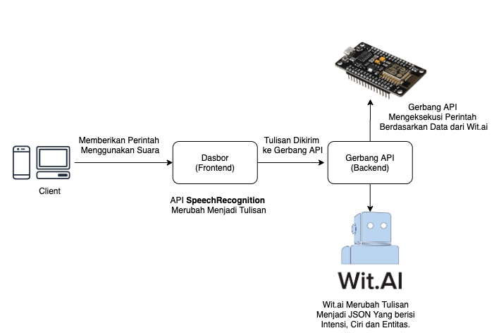

<!-- # Smart assistant with wit.ai for IoT -->
# Membuat Asisten Pintar dengan wit.ai untuk mengatur perangkat IoT

## Pengantar

Seperti yang kita tahu, sekarang banyak aplikasi asisten personal virtual seperti siri, alexa, google assistant,dll yang dapat mempermudah kita dalam kehidupan sehari hari. Kita dapat memberikan perintah berupa tulisan / suara yang nantinya asisten personal akan memberikan balikan berupa informasi/aksi. 

### Apa itu NLP ?
NLP Merupakan singkatan dari *Natrual Language Processing* adalah salah satu subset dari cabang ilmu kecerdasan buatan, cabang ilmu ini bertujuan untuk menghubungkan antara bahasa manusia dengan bahasa mesin/komputer.

### Tujuan
Hari ini kita ingin membuat aplikasi asisten personal dengan tujuan untuk mengontrol alat IoT (menyiram tanaman). Kita akan mengkombinasikan beberapa teknologi seperti NLP, IoT, SpeechAPI, dll.

## Daftar isi
- [Membuat Asisten Pintar dengan wit.ai untuk mengatur perangkat IoT](#membuat-asisten-pintar-dengan-witai-untuk-mengatur-perangkat-iot)
  - [Pengantar](#pengantar)
    - [Apa itu NLP ?](#apa-itu-nlp-)
    - [Tujuan](#tujuan)
  - [Daftar isi](#daftar-isi)
  - [Membangun Aplikasi](#membangun-aplikasi)
      - [Bagaimana cara kerjanya?](#bagaimana-cara-kerjanya)
        - [Alur Kerja](#alur-kerja)
        - [Alur Aksi](#alur-aksi)
      - [Prasayarat](#prasayarat)
        - [Perangkat Keras](#perangkat-keras)
        - [Perangkat Lunak](#perangkat-lunak)
  - [Mempersiapkan Lingkungan Pengembangan Aplikasi](#mempersiapkan-lingkungan-pengembangan-aplikasi)
    - [Menyiapkan MQTT Broker & MongoDB](#menyiapkan-mqtt-broker--mongodb)
    - [Menyiapkan Konfigurasi](#menyiapkan-konfigurasi)
  - [Melatih Aplikasi Wit untuk melakukan Pemrosesan Bahasa Natural (NLP)](#melatih-aplikasi-wit-untuk-melakukan-pemrosesan-bahasa-natural-nlp)
      - [Membuat Aplikasi Wit](#membuat-aplikasi-wit)
      - [Mentrain Aplikasi Wit dengan Ungkapan](#mentrain-aplikasi-wit-dengan-ungkapan)
        - [Menyalakan Pompa](#menyalakan-pompa)
        - [Mematikan Pompa](#mematikan-pompa)
        - [Mengambil Data Pompa](#mengambil-data-pompa)
      - [Membuat konektor wit pada aplikasi](#membuat-konektor-wit-pada-aplikasi)
        - [Memperbaharui *file* configurasi](#memperbaharui-file-configurasi)
  - [Membuat Gerbang API](#membuat-gerbang-api)
    - [Membuat konektor MongoDB](#membuat-konektor-mongodb)
    - [Membuat konektor MQTT](#membuat-konektor-mqtt)
    - [Membuat kontroler aplikasi](#membuat-kontroler-aplikasi)
    - [Membuat Rest API untuk Gerbang API](#membuat-rest-api-untuk-gerbang-api)
  - [Membuat Dasbor (*Frontend*)](#membuat-dasbor-frontend)
      - [Mengkonfigurasi Aplikasi *Frontend*](#mengkonfigurasi-aplikasi-frontend)
  - [Mengatur Perangkat IoT](#mengatur-perangkat-iot)
    - [Instalasi *Library*](#instalasi-library)
    - [Gambaran Skema Perangkat IoT](#gambaran-skema-perangkat-iot)
      - [Meng*compile* kode pada perangkat IoT](#mengcompile-kode-pada-perangkat-iot)
        - [Mengkonfigurasi Perangkat IoT](#mengkonfigurasi-perangkat-iot)
  - [Menjalankan Keseluruhan aplikasi](#menjalankan-keseluruhan-aplikasi)
    - [Gambaran Arsitektur](#gambaran-arsitektur)
    - [Jalankan Gerbang API, MongoDB Dan MQTT Broker](#jalankan-gerbang-api-mongodb-dan-mqtt-broker)
  - [Ringkasan & Penutup](#ringkasan--penutup)
    - [Apa Selanjutnya?](#apa-selanjutnya)
    - [Referensi](#referensi)

## Membangun Aplikasi

Sebelum membuat aplikasi, saya akan membahas cara kerjanya dan prasyarat untuk diikuti. 
Setelah itu, saya akan membahas setiap langkah sebelum menyiapkannya untuk dijalankan diproduksi.
#### Bagaimana cara kerjanya?

Dilihat secara garis besar, aplikasi ini akan bekerja seperti ini : 
1. Buka Browser > Pergi ke alamat **Dasbor Aplikasi**.
2. Klik Tombol `Listen` > Berikan perintah suara setelah `Log` menampilkan pesan `Recognition Started`
3. Apabila `Log` menampilkan pesan `Recognition ended` Maka perintah akan diteruskan ke server. 
4. Server akan melakukan perintah user dan menampilkan data (apabila yang diminta) ke dalam dasbor.

##### Alur Kerja


Cara kerja aplikasi ini cukup simpel, tetapi disini kita menggunakan banyak teknologi untuk mencapai tujuan tersebut. Ini digunakan agar aplikasi yang kita buat kali ini dapat dikembangkan dengan tujuan lebih luas lagi dengan mudah. 

Disini saya mencoba membagi aplikasi ini menjadi 5 bagian, yaitu: 
- Infrastuktur (MQTT Broker & Basis Data)
- Gerbang API (*Backend*)
- Dasbor (*Frontend*)
- Sistem NLP (Wit.ai)
- Perangkat IoT (Mikrokontroller)

Saya akan membahas masing-masing bagian ini.
Untuk memberikan gambaran lebih jelasnya bagaimana aplikasi ini bekerja dibalik layar. 
##### Alur Aksi



#### Prasayarat
Untuk dapat menjalankan keseluruhan bagian aplikasi, ada beberapa hal yang perlu dipersiapkan yaitu :

##### Perangkat Keras
- 1x NodeMCU ESP8266
- 1x DHT 22
- 1x Relay *Module*
##### Perangkat Lunak
- Browser yang mensupport API `SpeechRecognition`
- Docker & Docker-Compose
- NodeJS, NPM & Typescript
- Arduino IDE


## Mempersiapkan Lingkungan Pengembangan Aplikasi

Hal pertama yang kita lakukan adalah mempersiapkan lingkungan pengembangan aplikasi, disini kita menggunakan [typescript](https://www.typescriptlang.org/) & [npm](https://www.npmjs.com) untuk pengembangan aplikasi kita. Pastikan Typescript sudah terinstall, jika belum jalankan perintah `npm install -g typescript` untuk menginstall typescript
```json
// tsconfig.json
{
    "compilerOptions": {
      "target": "es5",
      "module": "commonjs",
      "outDir": "./dist",
      "rootDir": "./src",
      "strict": true,
      "moduleResolution": "node",
      "esModuleInterop": true,
      "skipLibCheck": true,
      "forceConsistentCasingInFileNames": true
    }
  }
  
```
Lakukan Konfigurasi *compiler* typescript dengan membuat *file* `tsconfig.json` berisikan JSON *file* di atas.

```json
// package.json
{
  "name": "iot-witai",
  "version": "1.0.0",
  "description": "",
  "main": "index.js",
  "scripts": {
    "start": "node ./dist/backend/app.js",
    "dev": "nodemon ./src/backend/app.ts",
    "build": "tsc -p ."
  },
  "keywords": [],
  "author": "",
  "license": "ISC",
  "devDependencies": {
    "@types/express": "^4.17.8",
    "@types/node": "^14.6.4",
    "nodemon": "^2.0.4",
    "ts-node": "^9.0.0"
  },
  "dependencies": {
    "@types/body-parser": "^1.19.0",
    "@types/mongoose": "^5.7.36",
    "@types/mqtt": "^2.5.0",
    "@types/node-wit": "^4.2.2",
    "body-parser": "^1.19.0",
    "cors": "^2.8.5",
    "dotenv": "^8.2.0",
    "express": "^4.17.1",
    "mongoose": "^5.10.7",
    "mqtt": "^4.2.1",
    "node-wit": "^6.0.0",
    "path": "^0.12.7"
  }
}

```

Lakukan Initalasi *package* yang akan digunakan aplikasi kita dengan membuat *file* `package.json` yang berisi JSON *file* di atas.

### Menyiapkan MQTT Broker & MongoDB
Kita juga akan menggunakan MQTT Broker(Mosquitto) & Basis data(MongoDB). Alih-alih menginstallnya di local/langsung di perangkat yang kita gunakan, kita akan menggunakan docker untuk menjalankan layanan tersebut.
```yaml
# Docker-compose.yml
version: '3.7'
services:
  mosquitto:
    image: eclipse-mosquitto:1.6.7
    hostname: mosquitto
    container_name: mosquitto
    ports:
      - 1883:1883
      - 9001:9001
    volumes:
      - ./conf/mosquitto.conf:/mosquitto/config/mosquitto.conf
  mongodb:
    image: mongo:latest
    hostname: mongo
    container_name: mongo-iot
    ports:
      - 27017:27017

```
Untuk mengaktifkan protokol websocket di dalam MQTT broker kita dapat mengatur konfigurasi *file* dengan membuat *file* `./conf/mosquitto.conf` yang nantinya akan berjalan pada PORT 9001
```

# this will listen for mqtt on tcp
listener 1883

# this will expect websockets connections
listener 9001
protocol websockets

```
### Menyiapkan Konfigurasi
Untuk menyimpan konfigurasi, kita menggunakan `.env` file. Buatlah *file* ini di `/` Folder dengan isi :
```
# .env 
PORT=3000
MQTT_URI=mqtt://localhost
MONGO_URI=mongodb://localhost:27017/jarwin
WIT_TOKEN= #Your wit token

```
Agar *file* `.env` dapat dibaca oleh aplikasi kita, disini kita akan membuat *file* untuk menload *file* `.env` dengan nama `config.ts` di dalam folder `./src/backend/`

```typescript
// config.ts
import * as dotenv from 'dotenv';
dotenv.config();

export default {
    mongoURI: process.env.MONGO_URI ?? '',
    mqttURI: process.env.MQTT_URI ?? '',
    witToken: process.env.WIT_TOKEN ?? '',
    port: process.env.PORT ?? 3000
}
```

Setelah semuanya siap, kita dapat memulai untuk melakukan pengembangan aplikasi. 

## Melatih Aplikasi Wit untuk melakukan Pemrosesan Bahasa Natural (NLP)
Disini kita menggunakan [wit.ai](https://wit.ai/) sebagai NLP sistem kita. Dengan ini kita dapat membuat asisten personal yang kita buat senatural mungkin dan tidak perlu untuk *membuat machine learning model* dengan alat seperti pytorch, tensorflow, dll  untuk aplikasi kita.


Pada bagian ini kita ingin mencoba untuk melatih aplikasi wit agar dapat mengenali beberapa perintah seperti `set_device` dan `get_device` pada perangkat IoT kita.

#### Membuat Aplikasi Wit
1. Buka Wit.ai dan masuk dengan menggunakan akun facebook
2. Buat aplikasi wit
3. Masukan nama aplikasi, bahasa yang digunakan, dan jenis _visibility_.
4. Klik `Create`

#### Mentrain Aplikasi Wit dengan Ungkapan
##### Menyalakan Pompa

1. Pilih menu `understanding`
2. Masukan Kata `Nyalakan Pompa` kedalam _form_ **Utterance**
3. Pilih _Add Intent_ dan masukan `set_device` kemudian `Create Intent`
4. Blok kata `pompa` dan masukan `device` pada kolom _entitiy_ kemudian `Create Entity`
5. Klik `Add Trait` dan pilih `wit/on_off` kemudian pilih `on`
6. Klik `Train and validate`

##### Mematikan Pompa
1. Masukan kata `matikan pompa` kedalam _form_ `Utterance`
2. Set **Intent** = `setdevice` , **Entity** device = `pompa` , dan `wit/on_off` = `off`
3. Klik `Train and validate`

##### Mengambil Data Pompa
1. Masukan kata `ambil data pompa` kedalam _form_ `Utterance`
2. Pilih _Add Intent_ dan masukan `get_device` kemudian `Create Intent`
3. Pastikan _Trait_ kosong
4. Klik `Train and validate`


Kita dapat mentrain aplikasi wit dengan frasa yang lainnya, Ini dapat membuat model dari aplikasi wit kita semakin natural dan dapat mendeteksi Intens dari frasa yang lainnya. Contoh : 
- Ambil statistik pompa
- Pompa nyalakan
- Pompa matikan

Lakukan proses serupa seperti di atas dan pastikan hasil output sudah valid setelah itu lakukan proses train.
#### Membuat konektor wit pada aplikasi
Buat *file* `wit.ts` di dalam folder `./src/backend/`
file ini kita buat sebagai konektor Gerbang API agar bisa memanggil Aplikasi Wit yang telah kita buat sebelumnya.
```typescript
// wit.ts
import {Wit} from 'node-wit';
import config from './config';

const client = new Wit({
    accessToken: config.witToken,
})

const get = async (message: string) => {
    try {
        const data = await client.message(message,{});
        return data;
    } catch (error) {
        return error;
    }
}

export default {
    get
}
```
Di *file* ini kita mempunya 1 fungsi `get(message)` yang digunakan untuk men*request message text* ke dalam aplikasi Wit kita, fungsi ini akan mengembalikan *response* dari wit.ai yang berisi **Text, Inten, Trait & Entity** yang mana tiap bagiannya memiliki bobot `confidence` sebagai patokan apakah prediksi NLP tersebut kuat atau tidak.

##### Memperbaharui *file* configurasi
Untuk mendapatkan token wit dari aplikasi kita dapat membuka menu **MyApps** > **[Nama aplikasi Wit]** > **Management** > **Setting** > **Server Access Token**.
```
# .env
WIT_TOKEN= <Your wit token>
```

## Membuat Gerbang API

Gerbang API akan digunakan sebagai perantara antara aplikasi Dasbor, Wit.ai, MQTT & MongoDB. Disini kita menggunakan REST API untuk berkomunikasi dengan aplikasi *frontend*.

### Membuat konektor MongoDB
Disini kita membuat konektor MongoDB yang nantinya akan digunakan aplikasi kita untuk menyimpan data-data riwayat dari statistik perangkat IoT. Kita membuat *file* `mongo.ts` di dalam folder `src/backend`
```typescript
// mongo.ts
import mongoose from 'mongoose'
import config from './config';

const { Schema,model,connect } = mongoose;

const init = () => {
    connect(config.mongoURI, {useNewUrlParser: true, useUnifiedTopology: true})
}

const sensorSchema = new Schema({
    deviceName: String,
    payload: Object,
    date: { type: Date, default: Date.now }
})

const sensorModel = model('sensor',sensorSchema)

export default {
    init,
    sensorModel
}
```

Konektor ini berisikan skema dari data yang nantinya akan kita simpan dan fungsi `init()` yang nantinya akan digunakan untuk menginisiasi koneksi kedalam MongoDB.


### Membuat konektor MQTT
Dalam berkomunikasi dengan perangkat IoT via Gerbang API, kita menggunakan protokol MQTT (TCP). Alasan utama kenapa kita menggunakan ini agar aplikasi kita dapat menangani *request* secara asinkronus dan tidak memblok proses yang lain. Selain itu juga karena protokol ini memang umum digunakan untuk berkomunikasi dengan perangkat IoT. 

Untuk membuat konektornya, kita buat *file* `mqtt.ts` di dalam direktori `/src/backend/`
```typescript
// mqtt.ts
import Mqtt from "mqtt";
import mongo from "./mongo";
import config from './config';

const client = Mqtt.connect(config.mqttURI,{
    queueQoSZero:false
})
  
const pub = (topic:string, message: any) => {
    client.publish(topic,message,{qos:2})
}

const sub = (topic:string) => {
    client.subscribe(topic,{qos:2})
}

client.on('message', (topic, message) => {
    if (topic == 'pompa-report') {
        const payload = JSON.parse(message.toString())
        
        if(payload.kind == "pompa-stats") {

            const sensor = new mongo.sensorModel({
            deviceName: payload['deviceName'],
            payload: {
                hum:payload["humidity"],
                temp:payload["temperature"] 
                }    
            })

            pub("web",JSON.stringify({
                humidity:payload.humidity,
                temp:payload.temperature,
                date: Date.now()
            }))
            
            sensor.save()
        }
    }
})

export default {
    pub,
    sub
}
```
Kode di atas secara garis besar membungkus fungsi `publish` dan `subscribe` yang ada pada `mqtt.client` agar dapat digunakan dengan mudah oleh modul lain. 

Disini kita juga menangani pesan yang masuk dari perangkat IoT, pesan laporan yang masuk dengan jenis `pompa-stats` akan dimasukan ke dalam basis data MongoDB. 
Setelah itu, isi payload yang berisi statistik perangkat akan dilanjutkan untuk dikirim ke Dasbor (*Frontend*) lewat MQTT Dengan topik `web`

### Membuat kontroler aplikasi
File kontroler ini akan bertugas untuk menentukan apakah hasil prediksi dari aplikasi Wit yang kita buat presisi atau tidak. Disini kita mengatur batas skor `confidence` yang harus dipenuhi adalah `0.90` agar hasil yang didapatkan sesuai dengan ekspetasi, jika kurang dari itu maka hasil prediksi tidak bisa digunakan.

Buat *file* `controller.ts` di dalam direktori `./src/backend/`
```typescript
// controller.ts
import Mqtt from './mqtt'


const execute = (payload:any) => {

    const {intents, entities, traits} = payload;
    
    const intent = intents
        .filter((i:any) => i.confidence > 0.90)
        .map((i:any) => i.name)    

    const entity = entities["device:device"]
        .filter((device:any) => (device.confidence > 0.90))
        .map((d:any) =>  d.value)
        
    if(intent[0] == "set_device"){
        const trait = traits["wit$on_off"]
            .filter((t:any) => t.confidence > 0.90)
            .map((obj:any) => obj.value)

        const status = trait[0] == "on" ? "1" : "0"
        Mqtt.pub(entity[0],status)
    }else if(intent[0] == "get_device") {
        Mqtt.pub("pompa-stats","1")
    }else{
        console.log("not found")
    }
}

export default {
    execute
}
```
Fungsi `execute` akan memastikan *Intent* dari *payload*, jika *Intent* tersebut adalah `set_device` maka sebuah pesan akan dipublish melalui MQTT dengan tujuan nama perangkat tersebut yang berisi pesan *Traits* (On/Off), jika *Intent* tersebut adalah `get_device` maka sebuah pesan akan dipublish melalui MQTT dengan tujuan `pompa-stats` yang berisi pesan `1` (Untuk memantik sensor). 

Fungsi `execute` akan diekspor dan nantinya akan dipanggil dari *entrypoint* Gerbang API.

### Membuat Rest API untuk Gerbang API
Kita akan menggunakan REST sebagai API. Tak hanya untuk menyediakan *endpoint* untuk backend, disini kita juga menggunakanya untuk menserve aplikasi dasbor (*Frontend*)

Buat *file* `app.ts` di dalam direktori  `./src/backend/`

```typescript
//app.ts
import express, { NextFunction } from 'express';
import wit from './wit';
import mqtt from './mqtt';
import controller from './controller';
import mongo from './mongo';
import bp from 'body-parser';
import path from 'path';
import config from './config';


const app = express();
const cors = require('cors')

app.use(cors())
app.use(bp.json())
app.get('/', async (req,res) => {
    res.send('This app is running properly')
})
app.get('/dashboard', (req,res) => {
    res.sendFile(path.join(__dirname , '../frontend' ,'index.html'))
})
app.post('/send', async (req,res) => {
    const {message} = req.body
    const payload = await wit.get(message)
    console.log(payload)
    controller.execute(payload)
    
    res.send("ok")
})

app.get('/sensor-data', async (req,res) => {
    try {
        const data = await mongo.sensorModel
        .find({})
        .limit(5)
        .sort({'date': -1})

        res.status(200).json(data)
    } catch (error) {
        res.status(400).json({msg:"Error"})
    }
})
app.listen(config.port, () => {
    mongo.init()
    mqtt.sub("pompa-report")
    console.log(`This app runs on ${config.port}`)
})
```
Disini kita mempunyai 4 *Endpoint*, yaitu:

1. `GET /`
*Endpoint* ini digunakan untuk mengecek apakah Aplikasi Gerbang API kita sudah berjalan & dapat diakses. 
2. `GET /dashboard`
*Endpoint* ini digunakan untuk menampilkan *file* `frontend/index.html` yang berisi aplikasi Dasbor (*frontend*).
3. `POST /send` 
*Endpoint* ini digunakan untuk menerima *payload* berupa *text* dari aplikasi *frontend*, *text* ini merupakan hasil dari pengolahan API `SpeechRecognition`. Setelah itu *text* tersebut akan digunakan sebagai parameter pesan yang dikirimkan ke dalam aplikasi Wit. Hasil dari pemorsesan dari proses tersebut akan diteruskan ke dalam kontroller yang nantinya akan menentukan eksekusi apa yang akan dilakukan. 
4. `GET /sensor-data`
*Endpoint* ini digunakan untuk menampilkan 5 data terakhir dari sensor pada perangkat IoT kita. Ini digunakan sebagai data awal di dalam aplikasi Dasbor

Aplikasi ini akan jalan di atas port yang kita deklarasikan di dalam *file* `.env`

## Membuat Dasbor (*Frontend*)
Agar dapat menggunakan aplikasi ini dengan mudah, maka disini kita membuat Dasbor(*Interface*/**) agar penggunaanya dapat lebih mudah. 
Aplikasi Dasbor ini akan meneruskan permintaan dari pengguna ke Gerbang API lewat panggilan HTTP, untuk menerima data menggunakan Websocket & HTTP.
Disini Kita menggunakan single *file* `index.html`, library css yang kita gunakan adalah Bootstrap 4 dan untuk menerima pesan MQTT(Websocket) kita menggunakan library `paho-mqtt`. 

Buat *file* `index.html` di dalam direktori `./src/`

```html
<!DOCTYPE html>
<html lang="en">
   <head>
      <meta charset="UTF-8">
      <meta name="viewport" content="width=device-width, initial-scale=1.0"/>
      <meta name="author" content="Aurelio De Rosa">
      <title>Dasbor</title>
      <link rel="stylesheet" href="https://maxcdn.bootstrapcdn.com/bootstrap/4.0.0/css/bootstrap.min.css" integrity="sha384-Gn5384xqQ1aoWXA+058RXPxPg6fy4IWvTNh0E263XmFcJlSAwiGgFAW/dAiS6JXm" crossorigin="anonymous">
      <style>
         .recognition-options
         {
            list-style: none;
            padding: 0;
         }

         .recognition-options li
         {
            display: inline;
         }

         fieldset
         {
            border: 0;
            margin: 0.5em 0;
            padding: 0;
         }

         legend
         {
            padding: 0;
         }
         .fade-in {
            opacity: 1;
            animation-name: fadeInOpacity;
            animation-iteration-count: 1;
            animation-timing-function: ease-in;
            animation-duration: 1s;
         }

         @keyframes fadeInOpacity {
            0% {
               opacity: 0;
            }
            100% {
               opacity: 1;
            }
         }

      </style>
   </head>
   <body>
    <div class="container">
        <div class="jumbotron">
      <h1 class="text-center">✨ Jarwis</h1>
      <p><small>
         Who need a Jarvis If we can build a jarwis *jk <br>
         Build With ❤️  &nbsp; By Iqbal Syamil
      </small></p>
      <p hidden class="js-api-support">API not supported</p>

      <div class="js-api-info">
         <div class="form-group">
            <textarea class="form-control" placeholder="Transcription" style="resize: none" aria-label="Transcription" id="transcription" class="log" readonly></textarea>
        </div>

         <form action="" method="get">
            <button type="button" id="button-play" class="button">Listen</button>
         </form>

         <h2>Log</h2>
         <div id="log" class="log"></div>
        </div>
        </div>
        <div>
           
         <table id="sensor-table" class="table">
            <thead>
               <tr>
                  <th>Date</th>
                  <th>Humidity</th>
                  <th>Temperature</th>
               </tr>
            </thead>
            <tbody>
            </tbody>
         </table>

        </div>
      </div>

      <script src="https://cdnjs.cloudflare.com/ajax/libs/paho-mqtt/1.0.1/mqttws31.min.js" type="text/javascript"></script>
      <script>
         const apiHost = "http://localhost:3000"; // host your api gateway i.e http://localhost:3000
         var mqtt;
         const mqttHost = "localhost"; // your mqtt host i.e. localhost
         const mqttPort = 9001; // port mqqt (websocket) default = 9001
         const dateLang = "id-ID" // dateLocale Format
         const speechRecognitionLang = "ID" // language used in speechRecognition i.e "EN"
         function mqttConnect() {
            mqtt = new Paho.MQTT.Client(mqttHost, Number(mqttPort), "client-web");
            mqtt.connect({onSuccess:onConnect});
            mqtt.onConnectionLost = onConnectionLost;
            mqtt.onMessageArrived = onMessageArrived;
         }
         
         function onConnect() {
            // Once a connection has been made, make a subscription and send a message.
            mqtt.subscribe("web");
         }
         function onMessageArrived(message) {
            const payload = JSON.parse(message.payloadString);
            var tablerow = tableref.insertRow(0)
            tablerow.className = 'fade-in'
            tablerow.innerHTML = `<tr class=fade-in> <td>${new Date(payload.date).toLocaleString(dateLang)}</td> <td>${payload.humidity}</td> <td>${payload.temp}</td> </tr>`
         }
         function onConnectionLost(responseObject) {
            if (responseObject.errorCode !== 0) {
               console.log("onConnectionLost:"+responseObject.errorMessage);
            }
         }
         
         function send(msg) {
            const raw = JSON.stringify({"message":msg});
            fetch(apiHost+"/send", {
               method: 'POST',
               headers: {
                  'Content-Type': 'application/json'
               },
               body: raw,
               redirect: 'follow'
            })
            .then(response => response.text())
            .then(result => console.log(result))
            .catch(error => console.log('error', error));            
         }
         function logEvent(string) {
            var log = document.getElementById('log');
            
            log.innerHTML = string + '<br />' + log.innerHTML;
         }
         
         window.SpeechRecognition = window.SpeechRecognition        ||
         window.webkitSpeechRecognition  ||
         null;
         
         if (!SpeechRecognition) {
            document.querySelector('.js-api-support').removeAttribute('hidden');
            document.querySelector('.js-api-info').setAttribute('hidden', '');
            [].forEach.call(document.querySelectorAll('form button'), function(button) {
               button.setAttribute('disabled', '');
            });
         } else {
            var recognizer = new SpeechRecognition();
            var transcription = document.getElementById('transcription');
            
            // Start recognising
            recognizer.addEventListener('result', function(event) {
               transcription.textContent = '';
               
               for (var i = event.resultIndex; i < event.results.length; i++) {
                  if (event.results[i].isFinal) {
                     send(event.results[i][0].transcript)
                     transcription.textContent = event.results[i][0].transcript +
                     ' (Confidence: ' + event.results[i][0].confidence + ')';
                  } else {
                     transcription.textContent += event.results[i][0].transcript;
                  }
               }
            });
            
            // Listen for errors
            recognizer.addEventListener('error', function(event) {
               logEvent('Recognition error: ' + event.message);
            });
            
            recognizer.addEventListener('end', function() {
               logEvent('Recognition ended');
            });
            
            document.getElementById('button-play').addEventListener('click', function() {
               document.getElementById('log').textContent = '';
               
               transcription.textContent = '';
               
               recognizer.lang = speechRecognitionLang
               recognizer.continuous = !true;
               recognizer.interimResults = true;
               
               try {
                  recognizer.start();
                  logEvent('Recognition started');
               } catch(ex) {
                  logEvent('Recognition error: ' + ex.message);
               }
            });
            var tableref = document.getElementById('sensor-table').getElementsByTagName('tbody')[0];
            document.addEventListener("DOMContentLoaded", function(event) {
               fetch(apiHost+"/sensor-data")
               .then(response => response.json())
               .then(result => {
                  result.forEach(res => {
                     tableref.insertRow(tableref.rows.length).innerHTML = `<tr> <td>${new Date(res.date).toLocaleString("id-ID")}</td> <td>${res.payload.hum}</td> <td>${res.payload.temp}</td> </tr>`
                  })
               });

               mqttConnect()
            });

         }
      </script>
   </body>
</html>

```
#### Mengkonfigurasi Aplikasi *Frontend* 
Ada hal yang perlu diperhatikan, pastikan konfigurasi pada aplikasi Dasbor sudah tepat, disini kita mendefinisikan beberapa hal, seperti alamat `apiHost`, alamat `mqqtHost`, port `mqttPort`, format tanggal `dateLang`, format bahasa yang digunakan pada *Speech Recognition* API `speechRecognitionLang` . 

```js
         /* ... Kode Terpotong */
      <script>
         const apiHost = "http://localhost:3000"; // host your api gateway i.e http://localhost:3000
         var mqtt;
         const mqttHost = "localhost"; // your mqtt host i.e. localhost
         const mqttPort = 9001; // port mqqt (websocket) default = 9001
         const dateLang = "id-ID" // dateLocale Format
         const speechRecognitionLang = "ID" // language used in speechRecognition i.e "EN"
         /* ... Kode Terpotong */

```

## Mengatur Perangkat IoT
Seperti pada bagian pendahuluan, tujuan dari perangkat IoT ini adalah agar kita dapat menyiram tanaman dengan menyalakan pompa. Jadi kita ingin membuat perangkat IoT Kita dapat melakukan 3 hal, yaitu: 
1. Menyalakan Pompa
2. Mematikan Pompa
3. Mengambil Data statistik pompa

### Instalasi *Library*
Disini kita menggunakan 3 library eksternal, pastikan kita sudah menginstall library tersebut di dalam arduino IDE. 
1. [PubSubClient.h](https://github.com/knolleary/pubsubclient)
2. [ArduinoJson.h](https://github.com/ekstrand/ESP8266wifi)
3. [DHTesp.h](https://github.com/beegee-tokyo/DHTesp)
3. [ESP8266WiFi.h](https://github.com/ekstrand/ESP8266wifi)
   
### Gambaran Skema Perangkat IoT
Dibawah ini merupakan gambaran skema dari perangkat IoT yang digunakan pada tulisan ini. Pastikan Pin yang digunakan sudah terkoneksi sesuai dengan skema. 


Catatan : 
- Garis Biru = Jalur sinyal digital/analog
- Garis Hijau = Jalur arus + Positif 
- Garis Merah = Jalur arus - (Ground/GND)

#### Meng*compile* kode pada perangkat IoT

Gunakan kode dibawah ini untuk di*compile* pada perangkat IoT (NodeMCU ESP8266).
```c++
#define SerialMon Serial

#include <SoftwareSerial.h>
#include <ESP8266WiFi.h>        // Include the Wi-Fi library
#include <PubSubClient.h>
#include <ArduinoJson.h>
#include "DHTesp.h"

//Create software serial object to communicate with SIM800L
WiFiClient espClient;
PubSubClient mqtt(espClient);
const char* ssid     = "";     // The SSID (name) of the Wi-Fi network you want to connect to
const char* password = "";     // The password of the Wi-Fi network
const char* broker = "";     // ip / domain your mqtt broker example (192.168.1.2)
const char* deviceName = "pompa";      // name of your device
StaticJsonDocument<250> wrapper;
DHTesp dht;


boolean res;
boolean mqttConnect() {
  char buffer[256];
  SerialMon.print("Connecting to ");
  SerialMon.print(broker);
  wrapper["deviceName"] = deviceName;

  // Connect to MQTT Broker
  boolean status = mqtt.connect(deviceName);

  if (status == false) {
    SerialMon.println("fail");
    return false;
  }
  SerialMon.println("success");
  mqtt.subscribe("pompa");
  mqtt.subscribe("pompa-stats");
  wrapper["kind"] = "connected";
  wrapper["status"] = true;
  size_t n = serializeJson(wrapper,buffer);
  mqtt.publish("report",buffer,n);
  return mqtt.connected();
}
void callback(char* topic, byte* payload, unsigned int length);


void setup()
{
  ESP.eraseConfig();
  SerialMon.begin(9600);
  WiFi.begin(ssid, password);
  dht.setup(D2, DHTesp::DHT22); // Connect DHT sensor to GPIO 17
  Serial.print("Connecting to ");
  pinMode(D1, OUTPUT); // initialize pin as OUTPUT
  Serial.println(ssid);
  while (WiFi.status() != WL_CONNECTED) { // Wait for the Wi-Fi to connect
        delay(1000);
        Serial.print('*');
  }


  mqtt.setServer(broker, 1883); // connect to mqtt broker with port (default : 1883)
  mqtt.setCallback(callback);

}

void loop()
{
  
  if (!mqtt.connected()) {
      SerialMon.println("Trying Connecting to mqtt broker");
    if(mqttConnect()){
      SerialMon.println("MQTT Connected");
    }
  }

  mqtt.loop();

}

void callback(char* topic, byte* payload, unsigned int length) {
  StaticJsonDocument<200> doc;
  char buffer[256];
  doc["deviceName"] = deviceName;
  doc["kind"] = topic;

  if(strcmp(topic, "pompa") == 0){
    if(payload[0] == '1'){
      digitalWrite(D1,1);
      doc["status"] = true;
      SerialMon.println("Pompa Nyala");
    }
    if(payload[0] == '0'){
      digitalWrite(D1,0);
      doc["status"] = false;
      SerialMon.println("Pompa Mati");
    }
      size_t n = serializeJson(doc,buffer);
      mqtt.publish("pompa-report",buffer,n);

  }else if(strcmp(topic, "pompa-stats") == 0){
    if(payload[0] == '1'){
      float humidity = dht.getHumidity();
      float temperature = dht.getTemperature();
      
      doc["humidity"] = humidity;
      doc["temperature"] = temperature;
      
      size_t n = serializeJson(doc,buffer);
      mqtt.publish("pompa-report",buffer,n);
    }
  }
  doc.clear();
}
```

Cara kerja dari program ini 
1. Perangkat akan melakukan koneksi ke dalam WiFI yang sudah di definisikan.
2. Setelah terkoneksi, perangkat akan melakukan koneksi ke MQTT Broker, mensubscribe topik perangkat, dan mempublish pesan ke topik report bahwa perangkat sudah terkoneksi.
3. Perangkat akan menunggu pesan masuk dari Gerbang API via protokol MQTT (TCP).
4. Apabila ada pesan yang masuk dengan topik "pompa" / nama perangkat maka perangkat akan melakukan perintah untuk menyalakan/mematikan pompa berdasarkan data payload yang dikirim oleh Gerbang API. Setelah proses eksekusi telah dilakukan, statusnya akan dikirim ke topik "pompa-report" yang sudah dibungkus dengan format JSON.
5. Apabila ada pesan yang masuk dengan topik "pompa-stats" maka perangkat akan mengambil data dari sensor DHT berupa Temperatur/*Temperature* dan Kelembabman / *Humidity* dan hasil nya akan dikirim ke topik "pompa-report" yang sudah dibungkus dengan format JSON.

##### Mengkonfigurasi Perangkat IoT
Lakukan Pengaturan pada perangkat IoT pada *file* `arduino/pompa.ino` dengan mengisi variable `ssid`, `password`, `broker`. 
```c++
// ... Kode Terpotong 

WiFiClient espClient;
PubSubClient mqtt(espClient);
const char* ssid     = "";     //  SSID (name) dari Wi-Fi
const char* password = "";     //  Password Wi-Fi 
const char* broker = "";     // ip / domain dari mqtt broker. contoh (192.168.1.2)
const char* deviceName = "pompa";      // nama perangkat
StaticJsonDocument<250> wrapper;
DHTesp dht;

// ... Kode Terpotong 

```
Setelah semuanya sudah terkonfigurasi maka lakukan proses *compile* kode tersebut pada perangkat IoT.


## Menjalankan Keseluruhan aplikasi
### Gambaran Arsitektur
Setelah kita melakukan beberapa step diatas, berikut ini adalah gambaran lengkap dari arsitektur yang digunakan di dalam proyek ini.


### Jalankan Gerbang API, MongoDB Dan MQTT Broker
Setelah seluruh konfigurasi selesai, jalankan perintah dibawah secara berurutan. 
1. `docker-compose up` (untuk menjalankan layanan MQTT Broker & MongoDB)
2. `npm run dev` (untuk menjalankan aplikasi dalam mode pengembangan)
3. Hubungkan perangkat IoT dengan daya.
4. Buka aplikasi Dasbor di url http://localhost:3000/dashboard


## Ringkasan & Penutup
Selamat! teman-teman sudah berhasil untuk membuat proyek untuk mengkontrol perangkat IoT. Di tulisan kali ini kita sudah belajar banyak hal seperti Bagaimana cara kerja dari NLP, Bagaimana caranya kita berkomunikasi dengan perangkat IoT, dll. Semoga apa yang sudah dipelajari dapat bermanfaat & bisa dikembangkan menjadi hal yang lebih keren lagi ! 😁 

Kode seluruh proyek ini dapat diakses [disini](https://github.com/2pai/wit-iot/) 

### Apa Selanjutnya?
Aplikasi ini masih belum sempurna, Jika teman-teman tertarik untuk mengembangkan ada beberapa ide seperti :
- Mengatur perangkat (Menambahkan, Menghapus, Mengedit)
- Menvisualisasikan perangkat yang aktif/tidak aktif
- Membuat versi Aplikasi *Mobile*
- Dan lain-lain

### Referensi
- https://medium.com/wit-ai/build-an-interactive-voice-enabled-android-app-with-wit-ai-6f6d72cf94be
- https://github.com/AurelioDeRosa/HTML5-API-demos/blob/master/demos/web-speech-api-demo.html
- https://developer.mozilla.org/en-US/docs/Web/API/Web_Speech_API